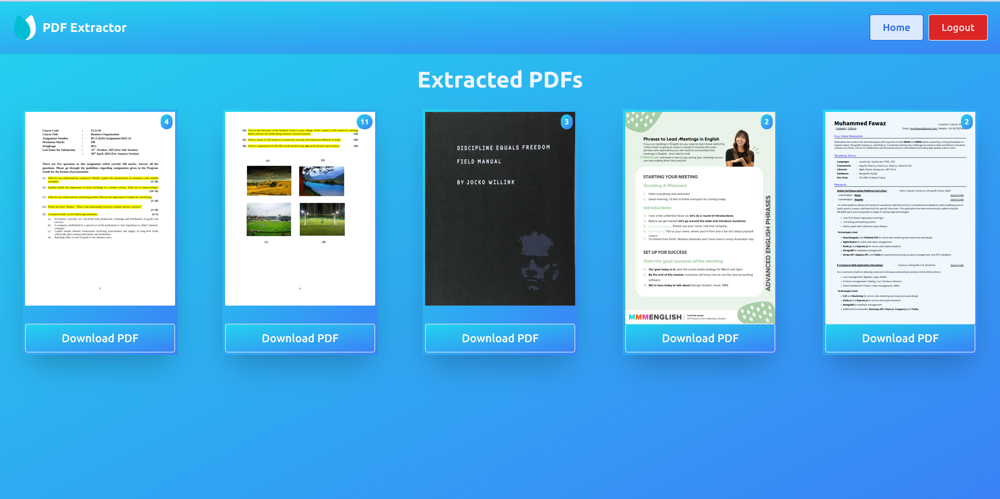

# PDF Page Extractor Web Application

## Description

This repository contains the client-side code for a web application built with React.js that allows users to upload PDF files and extract specific pages to create new PDFs. With this application, users can select the pages they want to include in the new PDF, offering a simple yet powerful PDF manipulation tool.

## Features

- **PDF File Upload**: Users can upload their PDF files to the server.
- **Page Extraction**: Select specific pages from the uploaded PDF to create a new PDF.
- **User-Friendly Interface**: A clean and intuitive user interface for easy navigation.
- **React.js**: Built with React.js for efficient client-side operations.
- **Customization**: Ability to customize the extracted PDF's page selection.

## Application Images

Here are some images from the application to give you a glimpse of its interface:

_Homepage: On the home page, you can select a PDF file._

_PdfSelected: In this view, you can see the selected PDF in its entirety and select the pages you want to extract for a new PDF._

_SavedPDFs: This section allows authenticated users to view the PDFs they've exported earlier._

## Installation

To run this application locally, follow these steps:

1. Clone the repository to your local machine.
2. Install the required dependencies using `npm install` or `npm i`.
3. Start the application using `npm run dev`.
4. Create a `.env` file and add the following environment variable:
   - `VITE_API_URL` - specifying the server-side URL
5. Access the web application through your web browser at `http://localhost:5173`.

## Usage

1. Visit the application in your browser.
2. Upload a PDF file.
3. Select the specific pages you want to extract and include in the new PDF.
4. Click the "Extract" or "Create PDF" button.
5. Download the newly generated PDF.

## Author

- Muhammed Fawaz

## Server-Side Hosted Link

- [Server-Side Hosted Link](https://pdf-extractor-server.onrender.com)
